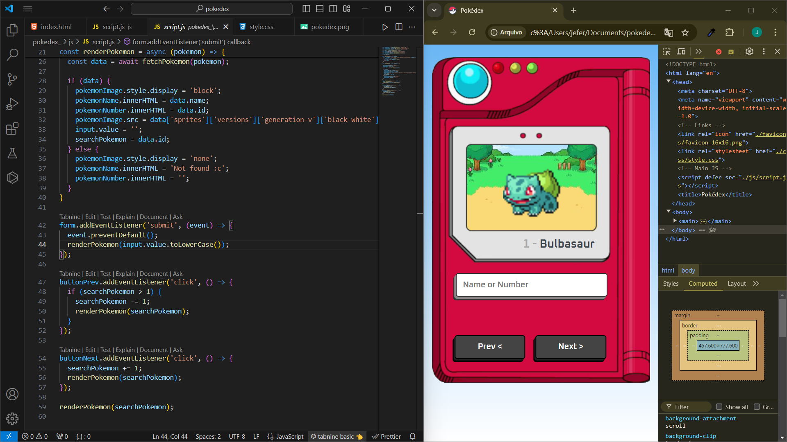

# pokedex
This interactive Pokédex lets Pokémon fans explore and catalog their favorite creatures. Users can search for details on abilities, types, and evolutions. With a smooth interface, it’s perfect for trainers to learn and share knowledge about the Pokémon world. Join us and uncover the secrets of the Pokédex

# pokedex

Image of Software

## Como Executar

How to Execute the Pokédex
Steps to Run
Download the Files: Download the Pokédex repository directly from GitHub.
1. Clone o repositório
   git clone https://github.com/jeferson-primer/pokedex

Extract the Files: If the download is a compressed file, extract it to a folder of your choice.

Open in Browser: Navigate to the folder where the files were extracted and open the index.html file in your preferred browser.

Enjoy the Game!
Now you can play and explore the Pokédex directly in your browser!   
